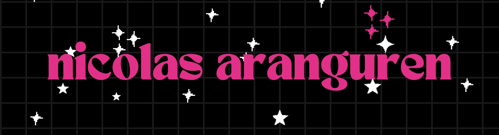
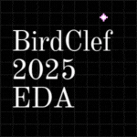
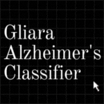

## About Me

Hello, I'm **Nicolás Aranguren García**, a Statistics student at the National University of Colombia. I’m deeply interested in **Data Science**, **Artificial Intelligence**, and **Neuroscience**, and I’m consistently looking for ways to apply statistical thinking to real-world problems.

---

## Interests

- Data Science  
- Artificial Intelligence  
- Neuroscience  
- Machine Learning  
- Big Data  
- Bioinformatics  
- Statistics  
- Creative thinking  

---

## Technologies I Use

  
  
  
  
  
  
  

---

## Pinned Repositories

  
  

---

## Contact

You can find me on  
[LinkedIn](https://www.linkedin.com/in/minicotina/)  
or  
[Instagram](https://www.instagram.com/minicotina/)

I'm always open to connecting and collaborating.

---

Thank you for visiting my profile.
