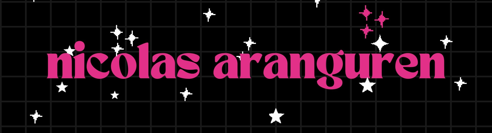

## About Me 👋✨

Hello! I'm **Nicolás Aranguren García** 🎓, a Statistics student at the National University of Colombia 🇨🇴. I have a strong passion for **Data Science** 📊, **Artificial Intelligence** 🤖, and **Business Intelligence** 📈. I’m always looking for ways to apply my statistical knowledge to solve real-world problems 🔍.

---

## Interests 🌟

- **Data Science** 📊🔍
- **Artificial Intelligence** 🤖💡
- **Business Intelligence** 📈📊

---

## Technologies I Use 🛠️💻

<!--  📉 Tableau  📊 Power BI 🤖 TensorFlow 🧠 Scikit-learn 📊 Pandas 📈 Matplotlib -->

## Pinned Repositories ⭐📁

## Contact 📬🌐

You can find me on 
 or on my 
. I’d love to connect! 🤝✨

---

Thank you for visiting my profile! 😊🎉

